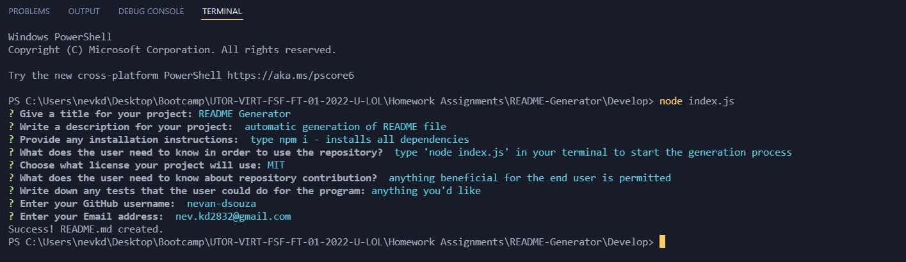

# README-Generator

## Description

The task was to create a command-line application that dynamically generates a professional README.md file from a user's input

## Links
> Repository Link: https://github.com/nevan-dsouza/README-Generator/

## Table of Contents

1. [Installation](#installation)
2. [Usage](#usage)
3. [Example](#example)
4. [Screenshot of the Program](#screenshot-of-the-program)
5. [Video Demonstration](#video-demonstration)

## Installation

Type 'npm i' or 'npm install' in the terminal to install the required dependencies. 

## Usage

To run the program, type "node index.js" in the command line (when you are in the directory of the index.js file) and then answer some questions. 

## Example

### Screenshot of the Program:

### Video Demonstration

https://www.awesomescreenshot.com/video/7525790?key=e88f66d8ef62ae4868f1daa1afc3c154